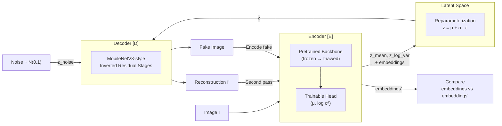
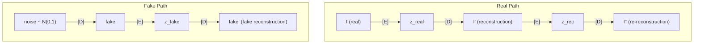

# Reversed Autoencoder: Training Dynamics & Loss Design

## 1. Architecture Overview

The Reversed Autoencoder is an adversarial variational architecture designed for
**unsupervised anomaly detection**. It trains an encoder and decoder in opposition:
the encoder learns to discriminate real from generated data, while the decoder learns
to fool the encoder by producing faithful reconstructions.

At inference, anomalies are detected by measuring discrepancies between the encoder's
representations of the original input and the decoder's reconstruction — regions the
decoder cannot faithfully reproduce are anomalous.



### Three Forward Paths per Training Step

The model processes three types of inputs through the encoder-decoder pipeline
each training step:



| Path                        | Input                                             | Purpose                                                                                                |
| --------------------------- | ------------------------------------------------- | ------------------------------------------------------------------------------------------------------ |
| **Real → Rec**              | `I → [E] → z → [D] → I'`                          | Core reconstruction — how well can the decoder reproduce real data?                                    |
| **Rec → Re-Rec**            | `I' → [E] → z' → [D] → I''`                       | Cycle consistency — do reconstructions survive a second round-trip?                                    |
| **Noise → Fake → Fake-Rec** | `noise → [D] → fake → [E] → z_fake → [D] → fake'` | Generation quality — can the decoder produce images from pure noise that the encoder considers normal? |

---

## 2. Loss Foundations

### Evidence Lower Bound (ELBO)

The Evidence Lower Bound comes from variational inference. For a generative model
with observed data $x$, latent variables $z$, and model parameters $\theta$, we want
to maximize the log-evidence $\log p_\theta(x)$. Since this is intractable, we instead
maximize a lower bound:

$$\log p_\theta(x) \geq \underbrace{\mathbb{E}_{q_\phi(z|x)}[\log p_\theta(x|z)]}_{\text{Reconstruction}} - \underbrace{D_{\text{KL}}(q_\phi(z|x) \| p(z))}_{\text{Regularization}} = \text{ELBO}$$

The ELBO decomposes into two competing objectives:

- **Reconstruction term** $\mathbb{E}_{q_\phi(z|x)}[\log p_\theta(x|z)]$: Measures how
  well the decoder can reconstruct the input from the latent code. Maximizing this
  pushes the model toward faithful reconstructions. In practice, this is computed as
  the negative mean pixel MSE:

$$\log p_\theta(x|z) \approx -\text{mean}_{h,w}\left[\text{MSE}(x, \hat{x})\right]$$

- **KL Divergence** $D_{\text{KL}}(q_\phi(z|x) \| p(z))$: Closed-form KLD from
  $\mathcal{N}(\mu, \text{diag}(\exp(\text{logvar})))$ to the standard normal prior
  $p(z) = \mathcal{N}(0, I)$:

$$D_{\text{KL}} = \frac{1}{2C} \sum_{c=1}^{C} \left( \mu_c^2 + \exp(\text{logvar}_c) - \text{logvar}_c - 1 \right)$$

Reduced via **mean** over both channels and spatial dimensions to produce a scalar
per sample. This replaces the previous Monte Carlo estimate (`log q(z|x) - log p(z)`)
which has non-zero variance — the closed form is exact, lower variance, and cheaper.

### Reduction Strategy: Mean over Everything

All loss terms use **mean reduction** over spatial dimensions $(H, W)$ and channels
$C$. This ensures:

1. **Consistent magnitudes** regardless of latent spatial resolution or image size
2. **Interpretable ranges** — reconstruction loss (MSE) lives in $[0, \sim2]$ for
   normalized inputs, ELBO in $[-2, 0]$, KLD in $[0, \sim1]$
3. **Meaningful hyperparameters** — `beta_kld` and `lambda_embed` don't need
   resolution-dependent tuning

The previous approach used an adaptive scaling factor
$\alpha = 32 / \sqrt{H_{\text{latent}} \cdot W_{\text{latent}}}$ and sum reductions,
which produced large values that obscured the relative balance between terms.

### ELBO Composition

With mean reductions and the `beta_kld` weighting:

$$\text{ELBO} = \underbrace{-\text{mean}_{h,w}[\text{MSE}(x, \hat{x})]}_{\text{logpx\_z} \in [-2, 0]} - \beta_{\text{kld}} \cdot \underbrace{\text{mean}_{h,w}[\text{KLD}]}_{\in [0, \sim1]}$$

Where `beta_kld` controls the reconstruction-regularization tradeoff:

- $\beta_{\text{kld}} < 1$: Prioritize reconstruction fidelity (current default: 0.25)
- $\beta_{\text{kld}} \geq 1$: Prioritize latent structure and disentanglement

### Embedding Loss

Feature consistency loss between two sets of intermediate encoder representations,
combining MSE and cosine similarity:

$$\mathcal{L}_{\text{embed}} = \frac{1}{L} \sum_{l=1}^{L} \text{mean}_{h,w} \left[ \frac{1}{2} \| f_l - f_l' \|^2_C + \left(1 - \frac{f_l \cdot f_l'}{\|f_l\|_C \|f_l'\|_C}\right) \right]$$

Where $f_l$ and $f_l'$ are the encoder's intermediate features at layer $l$ for the
original input and its reconstruction respectively. The MSE component captures
magnitude differences while cosine similarity captures directional alignment in
feature space. Both are computed along the channel axis $C$.

#### Depth-Weighted Embedding Loss (Optional)

When embedding loss is hard to decrease, deeper layers (closer to bottleneck) can
be given exponentially higher weight since their information is preservable through
the VAE bottleneck, while shallow layers' high-resolution spatial detail is
fundamentally lost:

$$\mathcal{L}_{\text{embed}}^{\text{weighted}} = \frac{\sum_{l=1}^{L} w_l \cdot \mathcal{L}_l}{\sum_{l=1}^{L} w_l}, \quad w_l = 2^{l - L}$$

For 5 layers: weights $\approx [0.06, 0.12, 0.25, 0.50, 1.00]$. This prevents the
decoder from being punished for an impossible task (reproducing high-frequency spatial
detail that the bottleneck cannot preserve) while still receiving gradient signal
for preservable deep features.

A middle-ground variant uses **cosine-only for shallow layers** (directional alignment
is achievable even when magnitude matching is not) and full MSE + cosine for deep layers.

### Pixel MSE

Per-pixel reconstruction error reduced along the channel dimension:

$$\text{MSE}_{\text{pixel}}(x, \hat{x}) = \frac{1}{C} \sum_{c=1}^{C} (x_c - \hat{x}_c)^2$$

This produces a spatial error map of shape $[B, H, W]$ that preserves spatial
information for downstream loss aggregation.

---

## 3. Encoder Loss

The encoder plays the role of a **discriminator** in this adversarial framework.
It is trained to:

1. **Maximize ELBO on real data** — build a structured latent space for normal samples
2. **Minimize ELBO on reconstructions and fakes** — learn to reject decoder outputs

$$\mathcal{L}_{\text{enc}} = \underbrace{-\text{ELBO}_{\text{real}}}_{\text{Fit normal manifold}} + \frac{1}{2} \left( \underbrace{\exp(\tau \cdot \text{ELBO}_{\text{rec}})}_{\text{Reject reconstructions}} + \underbrace{\exp(\tau \cdot \text{ELBO}_{\text{fake}})}_{\text{Reject fakes}} \right)$$

### Exponential Curriculum Weighting

The rejection terms use exponential curriculum weighting (`expelbo`):

$$\widetilde{\text{ELBO}} = \exp(\tau \cdot \text{ELBO})$$

Since ELBO values are negative (in the $[-2, 0]$ range with mean reductions), this
creates adaptive curriculum learning:

- **Bad fakes** (ELBO $\approx -2$): $\exp(-2\tau) \approx 0.14$ at $\tau=1$ →
  low contribution. The encoder already rejects these easily.
- **Good fakes** (ELBO $\approx 0$): $\exp(0) \approx 1$ →
  high contribution. These are hard to discriminate and need the most training.

The `expelbo_temp` ($\tau$) parameter controls curriculum sharpness:

- $\tau = 1$: Moderate differentiation ($\exp(-2) = 0.14$ vs $\exp(0) = 1$)
- $\tau = 2$: Sharp differentiation ($\exp(-4) = 0.02$ vs $\exp(0) = 1$)
- $\tau = 3$: Very sharp ($\exp(-6) = 0.002$ vs $\exp(0) = 1$)

Note: the ELBO multiplication previously in the formulation
($-\text{ELBO} \cdot \exp(\tau \cdot \text{ELBO})$) was removed. With ELBO properly
in the $[-2, 0]$ range, the exponential alone provides sufficient differentiation.
The old formulation had the encoder maximizing ALL ELBOs (including rec/fake) because
the $-\text{ELBO}$ factor flipped the sign; now the encoder purely minimizes exp-weighted
fake/rec quality — bad fakes contribute less, good fakes contribute more.

### Why NOT `expelbo_real` in the Encoder

Using curriculum weighting on the real term is counterproductive. The gradient
magnitude from $-\exp(\tau \cdot \text{ELBO}_{\text{real}})$ scales as:

$$\text{weight} = \tau \cdot \exp(\tau \cdot \text{ELBO}_{\text{real}})$$

| ELBO_real | Quality | Weight (τ=1) | Effect                              |
| --------- | ------- | ------------ | ----------------------------------- |
| ≈ -2.0    | Bad     | 0.14         | **Encoder gives up on bad reals**   |
| ≈ -0.2    | Good    | 0.82         | Encoder polishes already-good reals |

This is exactly backwards. The encoder should push **hardest** when real ELBO is bad
(structured latent space not yet formed), not give up. Curriculum weighting makes
sense for rejection ("don't waste energy on obvious garbage") but not for fitting
("always build a good latent space for reals"). The linear $-\text{ELBO}_{\text{real}}$
provides constant gradient weight regardless of current quality — which is correct.

### No Embedding Loss in the Encoder

The embedding loss is deliberately **excluded** from the encoder's training objective.

**Considered alternative: Adversarial embedding loss** — maximize embedding distance
in the encoder ("produce different features for originals vs reconstructions") while
minimizing it in the decoder. This was rejected for structural reasons:

1. **When backbone is frozen**: Embeddings come from frozen backbone intermediate
   layers. The trainable encoder head is _downstream_ of embedding extraction points.
   Adding $-\mathcal{L}_{\text{embed}}$ to the encoder loss produces gradients that
   hit the frozen wall and vanish — it's literally a **no-op**.

2. **When backbone is thawed**: The gradient would push the backbone to learn
   **adversarial features** — hypersensitive to imperceptible differences between
   originals and reconstructions (compression artifacts, subtle blur, frequency
   shifts). This corrupts the backbone's general-purpose feature hierarchy, making
   it detect noise rather than meaningful anomalies.

3. **Redundancy**: The existing ELBO rejection already provides discrimination
   signal at the right level — the latent space. The encoder head learns to assign
   different $(\mu, \text{logvar})$ to originals vs reconstructions, which is what
   KLD measures. Backbone features remain intact for anomaly detection.

Including embedding loss (even as adversarial maximization) in the encoder is either:

- A no-op (frozen backbone)
- Feature corruption (thawed backbone)
- Redundant with ELBO rejection (always)

---

## 4. Decoder Loss

The decoder plays the role of a **generator**. It is trained to produce outputs that
the encoder considers normal, whether starting from real latent codes or pure noise.

$$\mathcal{L}_{\text{dec}} = \underbrace{-\text{ELBO}_{\text{real}}}_{\text{Reconstruct faithfully}} \underbrace{- \frac{1}{2}(\text{ELBO}_{\text{rec}} + \text{ELBO}_{\text{fake}})}_{\text{Fool the encoder}} + \underbrace{\lambda_{\text{embed}} \cdot \mathcal{L}_{\text{embed}}}_{\text{Feature consistency}}$$

| Term                         | Signal to decoder                                                   |
| ---------------------------- | ------------------------------------------------------------------- |
| $-\text{ELBO}_{\text{real}}$ | Produce reconstructions $I'$ that match the input at pixel level    |
| $-\text{ELBO}_{\text{rec}}$  | Re-reconstructions $I''$ should also score highly (cycle stability) |
| $-\text{ELBO}_{\text{fake}}$ | Random generations, when round-tripped, should look normal          |
| $\mathcal{L}_{\text{embed}}$ | Reconstructions must be faithful in the encoder's feature space     |

### Why `ELBO_real` Is Essential in the Decoder

Since `kld_real` is stop-gradiented, the only gradient the decoder receives from
$-\text{ELBO}_{\text{real}}$ is:

$$\nabla_\theta (-(-\text{logpx\_z\_real})) = -\nabla_\theta \text{MSE}(\text{real}, \text{rec\_real})$$

**This IS the reconstruction loss.** It's the direct pixel-level signal saying
"make `rec_real` look like `real`." Without it, the decoder only receives:

- `elbo_rec/fake`: "Fool the encoder" — but no constraint to match the _specific input_
- `embed_loss`: Feature consistency — but only at intermediate representations

Without `elbo_real`, the decoder could collapse to producing the same
"average normal image" for every input (mode collapse), or any image the encoder
scores highly regardless of input correspondence. `elbo_real` **grounds** the
decoder to the input.

The three decoder signals are complementary and all necessary:

- `elbo_real` (pixel MSE): "Make every pixel right" → prevents hallucination
- `embed_loss` (features): "Make it right to the encoder" → prevents blur
- `elbo_rec + elbo_fake`: "Fool the encoder" → pushes toward normal manifold

Note that $\text{ELBO}_{\text{real}}$ in the decoder uses a **stop-gradiented**
$D_{\text{KL}}$ from the encoder step: the decoder receives pure reconstruction
gradient without conflicting KL signals from the encoder's latent parameterization.
The `kld_real` is present only to keep the loss value consistent with the ELBO
formulation but contributes zero gradient to the decoder.

### Embedding Loss as Perceptual Critic (Decoder Only)

The encoder acts as a **frozen perceptual critic** during decoder training. Its
intermediate features define the space where reconstruction fidelity is measured.
By restricting embedding loss to the decoder:

- The **encoder** remains free to produce divergent embeddings for anomalous inputs
  — preserving anomaly sensitivity.
- The **decoder** is pushed to always reconstruct "healthy" images that re-encode
  faithfully — learning the normal manifold.

At inference, the anomaly score:

$$\text{score}(x) = d\big(E(x),\ E(D(z))\big)$$

is high precisely because the encoder was **never trained to suppress** the
difference between original and reconstructed features.

---

## 5. Loss Weight Balance & Asymmetric Training Dynamics

### Effective Weight Analysis

```
Encoder: -elbo_real + 0.5 * (expelbo_rec + expelbo_fake)
          \_______/   \________________________________/
           weight 1.0    weight 0.5 each, curriculum-damped

Decoder: -elbo_real - 0.5 * (elbo_rec + elbo_fake) + λ * embed_loss
          \_______/   \____________________________/   \___________/
           weight 1.0    weight 0.5 each, full signal     extra term
```

The asymmetry between encoder (curriculum-damped rejection) and decoder (full signal)
creates a **built-in head start for the decoder**:

| Training phase         | Encoder effective signal          | Decoder effective signal                                  |
| ---------------------- | --------------------------------- | --------------------------------------------------------- |
| **Early** (bad fakes)  | `≈ -elbo_real + 0` (expelbo ≈ 0)  | Full: `-elbo_real - 0.5*(elbo_rec + elbo_fake) + λ*embed` |
| **Mid** (decent fakes) | `-elbo_real + moderate rejection` | Full signal (unchanged)                                   |
| **Late** (good fakes)  | `-elbo_real + full rejection`     | Full signal (unchanged)                                   |

The encoder starts soft (mostly fitting reals) and progressively sharpens its
discrimination as the decoder improves. The decoder always receives full gradient
pressure. This is appropriate because:

1. **The decoder's task is harder** — unconditional generation from bottleneck
   without skip connections requires consistent strong signal
2. **Early discrimination is free** — bad fakes are trivially rejected; wasting
   encoder capacity on them prevents it from building a good latent space for reals
3. **Late discrimination matters most** — when fakes are good, the encoder must
   learn subtle differences, which is when expelbo weight approaches 1.0

### Tuning the Balance

The 0.5 coefficient gives equal total weight to fitting (1.0) vs rejection (0.5 + 0.5 = 1.0).
Adjustments:

- If encoder becomes too aggressive (decoder can't keep up): reduce to 0.3 each
- If decoder runs away (encoder can't discriminate): increase to 0.7 each
- `expelbo_temp` ($\tau$): higher values sharpen the curriculum, giving the decoder
  more head start; lower values make curriculum weaker

---

## 6. Adversarial Equilibrium & Skip Connection Rationale

### Why No Skip Connections

In a standard U-Net autoencoder, skip connections provide a direct path from encoder
to decoder at each resolution level. For anomaly detection, this is catastrophic:
even when the model is trained exclusively on non-anomalous data, anomalous features
in the input propagate through skip connections directly to the output. The
reconstruction error — which is the anomaly signal — gets suppressed because the
anomaly bypasses the information bottleneck entirely.

By removing skip connections, all information must pass through the latent bottleneck.
The decoder can only reconstruct what the bottleneck preserves, and since the
bottleneck is trained on normal data, anomalous patterns cannot be faithfully
reconstructed.

**Note**: Decoder-internal skip connections (residual paths within the decoder
itself) are perfectly fine and beneficial — they don't leak anomalous information
from the encoder. The prohibition is specifically on encoder→decoder skip connections.

### KLD Gap as Equilibrium Diagnostic

The difference between KL divergences on fake and real samples provides a diagnostic
of the adversarial balance:

$$\Delta_{\text{KLD}} = D_{\text{KL}}^{\text{fake}} - D_{\text{KL}}^{\text{real}}$$

| $\Delta_{\text{KLD}}$ | State                       | Interpretation                                                                                                     |
| --------------------- | --------------------------- | ------------------------------------------------------------------------------------------------------------------ |
| $\gg 0$               | **Encoder dominant**        | Fakes require far more specialized encodings than reals. Decoder is underperforming.                               |
| $> 0$ (small)         | **Approaching equilibrium** | Decoder produces fakes nearly as "normal" as reals to the encoder.                                                 |
| $\approx 0$           | **Equilibrium**             | Encoder cannot distinguish fakes from reals via KLD alone. Ideal state.                                            |
| $< 0$                 | **Encoder collapsing**      | Encoder finds fakes more normal than reals. Pathological — the encoder has lost its reference frame for normality. |

---

## 7. Decoder Architecture

### Problem: Parameter Efficiency

The decoder must perform **unconditional generation from bottleneck** — essentially
the same task as a GAN generator — without skip connections. This requires high
capacity, but parameter count alone doesn't determine capability.

A 12M-parameter decoder using standard Conv2D + ResBlock is actually **less capable**
than a 4M MobileNetV3 encoder because:

| Aspect          | MobileNetV3 Encoder                           | Standard ResNet Decoder                |
| --------------- | --------------------------------------------- | -------------------------------------- |
| Conv type       | Depthwise separable (~9× fewer params per op) | Standard Conv2D                        |
| Attention       | Squeeze-and-Excite at every stage             | None                                   |
| Residual design | Inverted bottleneck (expand→DW→project)       | Standard (conv→conv→add)               |
| Upsampling      | N/A                                           | ConvTranspose (checkerboard artifacts) |
| Activations     | h-swish / relu6                               | LeakyReLU                              |

ConvTranspose upsampling is particularly problematic — it creates checkerboard
artifacts that the decoder wastes capacity learning to suppress.

### Solution: MobileNetV3-Symmetric Decoder

The current decoder uses MobileNetV3-style building blocks:

```
Latent z (B, H_bottleneck, W_bottleneck, C)
  → Concat with conditioning
  → [DecoderStage] × N stages
      Each stage: SpatialDropout → [InvRes × num_blocks] → UpsampleRefine 2×
  → InvRes head refinement
  → Conv 3×3 → tanh
```

**Key building blocks:**

- **InvertedResidualBlock**: expand (1×1) → depthwise (k×k) → SE → project (1×1)
  with residual. Same architecture as MobileNetV3 bottleneck blocks. More expressive
  per parameter than standard convolution.

- **UpsampleRefine**: Bilinear 2× upsample + Conv2D refinement. Eliminates
  checkerboard artifacts from transposed convolutions. The bilinear interpolation
  provides smooth spatial expansion; the learned conv refines and adjusts channels.

- **SqueezeExcite**: Channel attention at every stage. Allows the decoder to
  dynamically weight which channels matter at each spatial resolution.

- **SpatialDropout2D**: Applied at stage entry. Drops entire channels (not individual
  pixels), forcing diverse feature usage and preventing the decoder from relying on
  a small subset of channels.

### Stage Configuration

Default configuration mirrors MobileNetV3 Small's depth profile:

```python
DEFAULT_STAGE_CONFIG = [
    {"filters": 256, "num_blocks": 1, "expand_ratio": 2.0, "kernel_size": 5, "dropout_rate": 0.2},
    {"filters": 96,  "num_blocks": 3, "expand_ratio": 2.0, "kernel_size": 5, "dropout_rate": 0.2},
    {"filters": 48,  "num_blocks": 2, "expand_ratio": 1.5, "kernel_size": 3, "dropout_rate": 0.1},
    {"filters": 40,  "num_blocks": 3, "expand_ratio": 1.5, "kernel_size": 3, "dropout_rate": 0.1},
    {"filters": 24,  "num_blocks": 2, "expand_ratio": 1.5, "kernel_size": 3, "dropout_rate": 0.05},
    {"filters": 16,  "num_blocks": 1, "expand_ratio": 1.0, "kernel_size": 3, "dropout_rate": 0.0},
]
```

Design rationale:

- **More blocks at mid-resolution** (14×14 → 56×56): This is where structural
  detail is established. Low-res stages define coarse layout; high-res stages
  just add texture.
- **Larger kernels at low resolution** (5×5): Low-res features have larger
  effective receptive fields; 5×5 depthwise is cheap at small spatial sizes.
- **Decreasing dropout**: High dropout at coarse stages (force robustness),
  zero at final stage (preserve fine detail).
- **Conservative expand ratios** (1.0–2.0): The decoder doesn't need the
  extreme expansion (6×) used in classification encoders. Generation benefits
  more from depth (more blocks) than width (higher expansion).

### Conditioning: Concatenation vs FiLM

The current implementation uses **concatenation at the bottleneck** — the conditioning
tensor (a spatial feature map, not a vector) is concatenated with the latent code
before entering decoder stages.

For future multi-product training, **FiLM (Feature-wise Linear Modulation)** at
every decoder stage would provide richer conditioning:

$$\text{output} = \text{features} \cdot (1 + \gamma) + \beta$$

where $\gamma, \beta$ are predicted from the conditioning signal. FiLM modulates
behavior at every resolution without inflating channel dimensions. The current FiLM
implementation uses `Conv2D → GlobalAveragePooling2D` to handle spatial conditioning
tensors (rather than Dense layers for vector conditioning).

### Progressive Training (Future)

Since the decoder must generate from scratch without skip connections, it faces the
same challenge as GAN generators — learning all spatial scales simultaneously. The
ProGAN insight applies: train coarse-to-fine progressively.

```
Stage 1: z → 7×7 → bilinear_upsample(224×224) → encoder → loss
Stage 2: z → 7×7 → 14×14 → bilinear_upsample(224×224) → encoder → loss
  ...
Stage 6: z → 7×7 → ... → 224×224 → encoder → loss
```

With alpha blending during transitions:
$$\text{output} = (1 - \alpha) \cdot \text{upsample}(\text{prev\_stage}) + \alpha \cdot \text{current\_stage}$$

The encoder always sees full-resolution images (bilinearly upsampled). Each stage
reaches convergence before the next is activated, preventing cross-scale gradient
conflicts.

---

## 8. Callbacks

### Adversarial Equilibrium Callback

Monitors an exponential moving average (EMA) of $\Delta_{\text{KLD}}$ and dynamically
pauses encoder or decoder training to maintain balance.

```
    diff_kld (EMA)
    ──────────────────────────────────────
    ▲
    │   Encoder dominant
    │   → Pause encoder, decoder catches up
    │ ─ ─ ─ upper threshold ─ ─ ─
    │
    │   Healthy zone → train both
    │
    │ ─ ─ ─ lower threshold ─ ─ ─
    │   Encoder collapsing
    │   → Pause decoder, encoder recovers
    ▼
```

**Design principles:**

- **Hysteresis via minimum pause duration**: Once a component is paused, it stays
  paused for at least $N$ steps, even if the EMA briefly re-enters the healthy zone.
  This prevents rapid oscillation where one step of recovery immediately triggers
  a resume, followed by an immediate re-breach.

- **EMA smoothing**: Instantaneous $\Delta_{\text{KLD}}$ is noisy batch-to-batch.
  The EMA (default momentum $0.99 \approx$ 100-step window) filters transient spikes
  while remaining responsive to genuine regime shifts.

- **Asymmetric thresholds**: The lower threshold is tighter than the upper
  (e.g., $-0.5$ vs $+2.0$) because encoder collapse ($\Delta < 0$) is far more
  dangerous than encoder dominance ($\Delta \gg 0$). Encoder dominance simply means
  the decoder needs more training; encoder collapse means the model's concept of
  normality is corrupted.

- **Forward pass without gradients**: When the encoder is paused, its forward pass
  still executes to provide latent codes and embeddings for decoder training — only
  gradient updates are skipped.

### Validation `diff_kld < 0` Is Expected

A consistent observation is that $\Delta_{\text{KLD}}$ on the validation set stabilizes
below zero while the training set reaches equilibrium. This is expected:

- The encoder's trainable head is optimized for training data — it has higher
  discrimination confidence on samples it has seen.
- On novel validation images, the encoder is less certain about reals, narrowing
  the KLD gap or pushing it negative.
- This reflects a **generalization gap in discrimination**, not in reconstruction.
  As long as `val_loss_rec` continues decreasing, the model is learning effectively.

### Backbone Thaw Callback

Monitors validation reconstruction loss and unfreezes the pretrained encoder backbone
when training plateaus, applying a discriminative learning rate.

**Prerequisites before thawing (all must be met):**

1. **Decoder reconstruction has converged**: `loss_rec` and `loss_embed` are plateaued
   or slowly decreasing for an extended period ($\sim$ 20–30 epochs). The decoder must
   produce good-enough reconstructions that fine-tuning the backbone adapts to
   meaningful signal, not noise.

2. **Adversarial equilibrium is stable**: The equilibrium callback should be in the
   "train both" state consistently, not oscillating between pauses.

3. **Validation metrics have plateaued**: If `val_loss_rec` is still improving with a
   frozen backbone, thawing is premature — there are still free gains available
   without risking pretrained features.

**Thawing procedure:**

The backbone learning rate is set to a small fraction of the head's learning rate
(e.g., $0.01\times$) to prevent **catastrophic forgetting** of pretrained features.
The frozen backbone phase is where the decoder learns the "language" of the encoder's
features; thawing is the final refinement to adapt those features from the pretrained
domain (e.g., ImageNet) to the target domain (e.g., X-ray imagery).

```
Epoch 0                   Plateau detected         Post-thaw
│                         │                        │
▼                         ▼                        ▼
┌─────────────────────────┬────────────────────────┐
│  Frozen backbone        │  Thawed backbone       │
│                         │  (discriminative LR)   │
│  Train: head + decoder  │  Train: all            │
│  Goal: decoder learns   │  Goal: adapt backbone  │
│  encoder's feature      │  features to target    │
│  "language"             │  domain                │
└─────────────────────────┴────────────────────────┘
```

---

## 9. Hyperparameter Reference

| Parameter            | Default | Range      | Effect                                                               |
| -------------------- | ------- | ---------- | -------------------------------------------------------------------- |
| `beta_kld`           | 0.25    | 0.01–2.0   | KLD weight in ELBO. <1 = reconstruction focus; ≥1 = latent structure |
| `expelbo_temp`       | 1.0     | 0.5–3.0    | Curriculum sharpness. Higher = more head start for decoder           |
| `lambda_embed`       | 1.0     | 0.1–5.0    | Embedding loss weight. Higher = more perceptual fidelity             |
| `upper_threshold`    | 2.0     | 1.0–5.0    | diff_kld above which encoder is paused                               |
| `lower_threshold`    | -0.5    | -2.0–0.0   | diff_kld below which decoder is paused (tighter = safer)             |
| `ema_momentum`       | 0.99    | 0.95–0.999 | EMA smoothing for equilibrium callback                               |
| `min_pause_steps`    | 50      | 20–200     | Minimum steps a component stays paused                               |
| `backbone_lr_factor` | 0.01    | 0.001–0.1  | Backbone LR relative to head after thawing                           |

---

## 10. Data Augmentation Rationale

Robust augmentations (rotation, illumination, contrast) are applied despite being
unlikely in production. The reasoning:

1. **Inter-product variation**: X-rays from one product to the next can be very
   different. Augmentations teach the model to be invariant to acquisition nuances.

2. **Acquisition artifacts**: Slight variations in image capture (positioning,
   exposure, voltage) should NOT trigger anomaly detection. Augmentations ensure
   these variations are absorbed into the "normal" manifold.

3. **Focus on true anomalies**: By making the model robust to expected visual
   variation, the anomaly signal becomes specific to genuine defects rather than
   imaging conditions.

The trade-off is that aggressive augmentations make reconstruction harder (the
decoder must reproduce augmented versions, not just canonical views), which is why
decoder architecture capacity matters.

---

## 11. Design Decisions Considered & Rejected

| Idea                               | Verdict     | Reason                                                                                 |
| ---------------------------------- | ----------- | -------------------------------------------------------------------------------------- |
| Adversarial embed in encoder       | ❌          | No-op when frozen; corrupts features when thawed; redundant with ELBO                  |
| `expelbo_real` in encoder          | ❌          | Curriculum on fitting term reduces signal when reals are bad = wrong direction         |
| Skip connections (encoder→decoder) | ❌          | Leaks anomalous features, suppresses anomaly signal                                    |
| Sum reduction in losses            | ❌ Replaced | Resolution-dependent magnitudes; hard to interpret/tune                                |
| `log_normal_pdf` for KLD           | ❌ Replaced | Monte Carlo estimate with variance; closed form is exact and cheaper                   |
| Diffusion decoder                  | ❌          | Multiple denoising steps kills CPU real-time inference                                 |
| ViT encoder                        | ❌          | Slower on CPU than MobileNet; no natural multi-scale features for spatial anomaly maps |
| Standard ConvTranspose upsampling  | ❌ Replaced | Checkerboard artifacts waste decoder capacity                                          |
