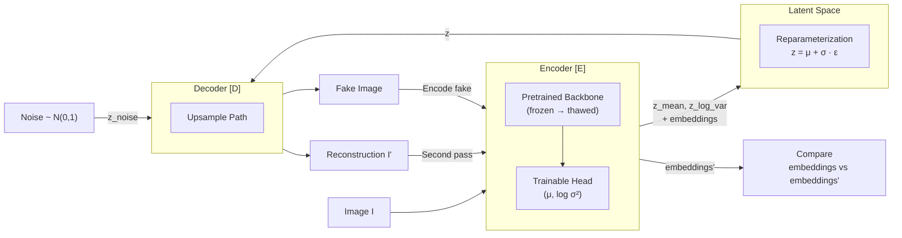
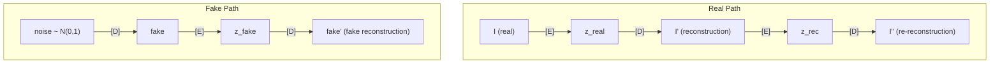

# Reversed Autoencoder: Training Dynamics & Loss Design

## 1. Architecture Overview

The Reversed Autoencoder is an adversarial variational architecture designed for
**unsupervised anomaly detection**. It trains an encoder and decoder in opposition:
the encoder learns to discriminate real from generated data, while the decoder learns
to fool the encoder by producing faithful reconstructions.

At inference, anomalies are detected by measuring discrepancies between the encoder's
representations of the original input and the decoder's reconstruction — regions the
decoder cannot faithfully reproduce are anomalous.



### Three Forward Paths per Training Step

The model processes three types of inputs through the encoder-decoder pipeline
each training step:



| Path                        | Input                                             | Purpose                                                                                                |
| --------------------------- | ------------------------------------------------- | ------------------------------------------------------------------------------------------------------ |
| **Real → Rec**              | `I → [E] → z → [D] → I'`                          | Core reconstruction — how well can the decoder reproduce real data?                                    |
| **Rec → Re-Rec**            | `I' → [E] → z' → [D] → I''`                       | Cycle consistency — do reconstructions survive a second round-trip?                                    |
| **Noise → Fake → Fake-Rec** | `noise → [D] → fake → [E] → z_fake → [D] → fake'` | Generation quality — can the decoder produce images from pure noise that the encoder considers normal? |

---

## 2. Loss Foundations

### Evidence Lower Bound (ELBO)

The Evidence Lower Bound comes from variational inference. For a generative model
with observed data $x$, latent variables $z$, and model parameters $\theta$, we want
to maximize the log-evidence $\log p_\theta(x)$. Since this is intractable, we instead
maximize a lower bound:

$$\log p_\theta(x) \geq \underbrace{\mathbb{E}_{q_\phi(z|x)}[\log p_\theta(x|z)]}_{\text{Reconstruction}} - \underbrace{D_{\text{KL}}(q_\phi(z|x) \| p(z))}_{\text{Regularization}} = \text{ELBO}$$

The ELBO decomposes into two competing objectives:

- **Reconstruction term** $\mathbb{E}_{q_\phi(z|x)}[\log p_\theta(x|z)]$: Measures how
  well the decoder can reconstruct the input from the latent code. Maximizing this
  pushes the model toward faithful reconstructions. In practice, this is computed as
  the negative scaled pixel MSE:

$$\log p_\theta(x|z) \approx -\alpha \sum_{h,w} \text{MSE}(x, \hat{x})$$

- **KL Divergence** $D_{\text{KL}}(q_\phi(z|x) \| p(z))$: Measures how far the
  encoder's posterior distribution $q_\phi(z|x)$ deviates from the prior
  $p(z) = \mathcal{N}(0, I)$. Minimizing this regularizes the latent space,
  preventing the encoder from encoding each input into an isolated point and
  ensuring smooth interpolation.

$$D_{\text{KL}} = \alpha \left( \log q_\phi(z|x) - \log p(z) \right)$$

Where $\alpha$ is an adaptive scaling factor based on the spatial dimensions of the
latent space, ensuring consistent gradient energy across different image resolutions:

$$\alpha = \frac{32}{\sqrt{H_{\text{latent}} \cdot W_{\text{latent}}}}$$

### Embedding Loss

Feature consistency loss between two sets of intermediate encoder representations,
combining MSE and cosine similarity:

$$\mathcal{L}_{\text{embed}} = \frac{1}{L} \sum_{l=1}^{L} \mathbb{E}_{h,w} \left[ \frac{1}{2} \| f_l - f_l' \|^2_C + \left(1 - \frac{f_l \cdot f_l'}{\|f_l\|_C \|f_l'\|_C}\right) \right]$$

Where $f_l$ and $f_l'$ are the encoder's intermediate features at layer $l$ for the
original input and its reconstruction respectively. The MSE component captures
magnitude differences while cosine similarity captures directional alignment in
feature space. Both are computed along the channel axis $C$.

### Pixel MSE

Per-pixel reconstruction error reduced along the channel dimension:

$$\text{MSE}_{\text{pixel}}(x, \hat{x}) = \frac{1}{C} \sum_{c=1}^{C} (x_c - \hat{x}_c)^2$$

This produces a spatial error map of shape $[B, H, W]$ that preserves spatial
information for downstream loss aggregation.

---

## 3. Encoder Loss

The encoder plays the role of a **discriminator** in this adversarial framework.
It is trained to:

1. **Maximize ELBO on real data** — build a structured latent space for normal samples
2. **Minimize ELBO on reconstructions and fakes** — learn to reject decoder outputs

$$\mathcal{L}_{\text{enc}} = \underbrace{-\text{ELBO}_{\text{real}}}_{\text{Fit normal manifold}} + \frac{1}{2} \left( \underbrace{\widetilde{\text{ELBO}}_{\text{rec}}}_{\text{Reject reconstructions}} + \underbrace{\widetilde{\text{ELBO}}_{\text{fake}}}_{\text{Reject fakes}} \right)$$

### Exponential Curriculum Weighting

The rejection terms use exponential curriculum weighting rather than raw negative ELBO:

$$\widetilde{\text{ELBO}} = -\text{ELBO} \cdot \exp(\alpha \cdot \text{ELBO})$$

Since ELBO values are negative ($-\infty$ to $0$), this weighting creates adaptive
curriculum learning:

- **Bad fakes** (very negative ELBO): $\exp(\alpha \cdot \text{ELBO}) \approx 0$ →
  low weight. The encoder already rejects these easily; no need to train on them.
- **Good fakes** (ELBO closer to 0): $\exp(\alpha \cdot \text{ELBO}) \approx 1$ →
  high weight. These are hard to discriminate and receive the most training focus.

This ensures the encoder progressively focuses on subtler discrimination tasks as
the decoder improves, preventing wasted gradient energy on already-solved cases.

### No Embedding Loss in the Encoder

The embedding loss is deliberately **excluded** from the encoder's training objective.
Including it would instruct the encoder: _"produce similar intermediate features
regardless of whether the input is real or a reconstruction."_ This is harmful for
anomaly detection for two reasons:

1. **Early in training**: The decoder produces poor reconstructions. Embedding loss
   would push the encoder to treat poor reconstructions the same as real images,
   **corrupting pretrained features** to match a weak decoder.

2. **Late in training**: Reconstructions are good, so embedding loss approaches zero
   — providing no useful gradient signal.

3. **At inference**: Anomaly detection relies on the encoder producing **divergent**
   features for anomalous inputs versus their (pseudo-healthy) reconstructions.
   Training the encoder to suppress this divergence would directly **destroy the
   anomaly detection signal**.

The embedding loss in the encoder is either harmful (early), useless (late), or
counterproductive (at inference) — a lose-lose-lose proposition.

---

## 4. Decoder Loss

The decoder plays the role of a **generator**. It is trained to produce outputs that
the encoder considers normal, whether starting from real latent codes or pure noise.

$$\mathcal{L}_{\text{dec}} = \underbrace{-\text{ELBO}_{\text{real}}}_{\text{Good reconstructions}} \underbrace{- \frac{1}{2}(\text{ELBO}_{\text{rec}} + \text{ELBO}_{\text{fake}})}_{\text{Fool the encoder}} + \underbrace{\mathcal{L}_{\text{embed}}}_{\text{Feature consistency}}$$

| Term                         | Signal to decoder                                                   |
| ---------------------------- | ------------------------------------------------------------------- |
| $-\text{ELBO}_{\text{real}}$ | Produce reconstructions $I'$ that the encoder scores highly         |
| $-\text{ELBO}_{\text{rec}}$  | Re-reconstructions $I''$ should also score highly (cycle stability) |
| $-\text{ELBO}_{\text{fake}}$ | Random generations, when round-tripped, should look normal          |
| $\mathcal{L}_{\text{embed}}$ | Reconstructions must be faithful in the encoder's feature space     |

Note that $\text{ELBO}_{\text{real}}$ in the decoder uses a **stop-gradiented**
$D_{\text{KL}}$ from the encoder step: the decoder receives pure reconstruction
gradient without conflicting KL signals from the encoder's latent parameterization.

### Embedding Loss as Perceptual Critic (Decoder Only)

The encoder acts as a **frozen perceptual critic** during decoder training. Its
intermediate features define the space where reconstruction fidelity is measured.
By restricting embedding loss to the decoder:

- The **encoder** remains free to produce divergent embeddings for anomalous inputs
  — preserving anomaly sensitivity.
- The **decoder** is pushed to always reconstruct "healthy" images that re-encode
  faithfully — learning the normal manifold.

At inference, the anomaly score:

$$\text{score}(x) = d\big(E(x),\ E(D(z))\big)$$

is high precisely because the encoder was **never trained to suppress** the
difference between original and reconstructed features.

---

## 5. Adversarial Equilibrium & Skip Connection Rationale

### Why No Skip Connections

In a standard U-Net autoencoder, skip connections provide a direct path from encoder
to decoder at each resolution level. For anomaly detection, this is catastrophic:
even when the model is trained exclusively on non-anomalous data, anomalous features
in the input propagate through skip connections directly to the output. The
reconstruction error — which is the anomaly signal — gets suppressed because the
anomaly bypasses the information bottleneck entirely.

By removing skip connections, all information must pass through the latent bottleneck.
The decoder can only reconstruct what the bottleneck preserves, and since the
bottleneck is trained on normal data, anomalous patterns cannot be faithfully
reconstructed.

### KLD Gap as Equilibrium Diagnostic

The difference between KL divergences on fake and real samples provides a diagnostic
of the adversarial balance:

$$\Delta_{\text{KLD}} = D_{\text{KL}}^{\text{fake}} - D_{\text{KL}}^{\text{real}}$$

| $\Delta_{\text{KLD}}$ | State                       | Interpretation                                                                                                     |
| --------------------- | --------------------------- | ------------------------------------------------------------------------------------------------------------------ |
| $\gg 0$               | **Encoder dominant**        | Fakes require far more specialized encodings than reals. Decoder is underperforming.                               |
| $> 0$ (small)         | **Approaching equilibrium** | Decoder produces fakes nearly as "normal" as reals to the encoder.                                                 |
| $\approx 0$           | **Equilibrium**             | Encoder cannot distinguish fakes from reals via KLD alone. Ideal state.                                            |
| $< 0$                 | **Encoder collapsing**      | Encoder finds fakes more normal than reals. Pathological — the encoder has lost its reference frame for normality. |

---

## 6. Callbacks

### Adversarial Equilibrium Callback

Monitors an exponential moving average (EMA) of $\Delta_{\text{KLD}}$ and dynamically
pauses encoder or decoder training to maintain balance.

```
    diff_kld (EMA)
    ──────────────────────────────────────
    ▲
    │   Encoder dominant
    │   → Pause encoder, decoder catches up
    │ ─ ─ ─ upper threshold ─ ─ ─
    │
    │   Healthy zone → train both
    │
    │ ─ ─ ─ lower threshold ─ ─ ─
    │   Encoder collapsing
    │   → Pause decoder, encoder recovers
    ▼
```

**Design principles:**

- **Hysteresis via minimum pause duration**: Once a component is paused, it stays
  paused for at least $N$ steps, even if the EMA briefly re-enters the healthy zone.
  This prevents rapid oscillation where one step of recovery immediately triggers
  a resume, followed by an immediate re-breach.

- **EMA smoothing**: Instantaneous $\Delta_{\text{KLD}}$ is noisy batch-to-batch.
  The EMA (default momentum $0.99 \approx$ 100-step window) filters transient spikes
  while remaining responsive to genuine regime shifts.

- **Asymmetric thresholds**: The lower threshold is tighter than the upper
  (e.g., $-0.5$ vs $+2.0$) because encoder collapse ($\Delta < 0$) is far more
  dangerous than encoder dominance ($\Delta \gg 0$). Encoder dominance simply means
  the decoder needs more training; encoder collapse means the model's concept of
  normality is corrupted.

- **Forward pass without gradients**: When the encoder is paused, its forward pass
  still executes to provide latent codes and embeddings for decoder training — only
  gradient updates are skipped.

### Validation `diff_kld < 0` Is Expected

A consistent observation is that $\Delta_{\text{KLD}}$ on the validation set stabilizes
below zero while the training set reaches equilibrium. This is expected:

- The encoder's trainable head is optimized for training data — it has higher
  discrimination confidence on samples it has seen.
- On novel validation images, the encoder is less certain about reals, narrowing
  the KLD gap or pushing it negative.
- This reflects a **generalization gap in discrimination**, not in reconstruction.
  As long as `val_loss_rec` continues decreasing, the model is learning effectively.

### Backbone Thaw Callback

Monitors validation reconstruction loss and unfreezes the pretrained encoder backbone
when training plateaus, applying a discriminative learning rate.

**Prerequisites before thawing (all must be met):**

1. **Decoder reconstruction has converged**: `loss_rec` and `loss_embed` are plateaued
   or slowly decreasing for an extended period ($\sim$ 20–30 epochs). The decoder must
   produce good-enough reconstructions that fine-tuning the backbone adapts to
   meaningful signal, not noise.

2. **Adversarial equilibrium is stable**: The equilibrium callback should be in the
   "train both" state consistently, not oscillating between pauses.

3. **Validation metrics have plateaued**: If `val_loss_rec` is still improving with a
   frozen backbone, thawing is premature — there are still free gains available
   without risking pretrained features.

**Thawing procedure:**

The backbone learning rate is set to a small fraction of the head's learning rate
(e.g., $0.01\times$) to prevent **catastrophic forgetting** of pretrained features.
The frozen backbone phase is where the decoder learns the "language" of the encoder's
features; thawing is the final refinement to adapt those features from the pretrained
domain (e.g., ImageNet) to the target domain (e.g., X-ray imagery).

```
Epoch 0                   Plateau detected         Post-thaw
│                         │                        │
▼                         ▼                        ▼
┌─────────────────────────┬────────────────────────┐
│  Frozen backbone        │  Thawed backbone       │
│                         │  (discriminative LR)   │
│  Train: head + decoder  │  Train: all            │
│  Goal: decoder learns   │  Goal: adapt backbone  │
│  encoder's feature      │  features to target    │
│  "language"             │  domain                │
└─────────────────────────┴────────────────────────┘
```
