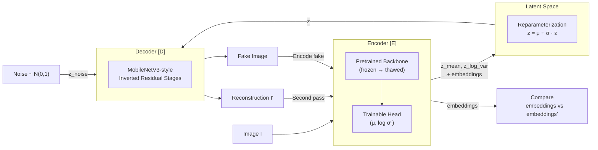
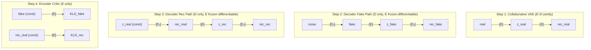

# Architecture Overview

The Reversed Autoencoder is an adversarial variational architecture designed for **unsupervised anomaly detection**. It combines **collaborative VAE training** (encoder and decoder jointly maximize ELBO) with **adversarial training** (encoder discriminates decoder outputs via KLD; decoder fools encoder with full gradient flow through a frozen-but-differentiable encoder).

At inference, anomalies are detected by measuring discrepancies between the encoder's representations of the original input and the decoder's reconstruction — regions the decoder cannot faithfully reproduce are anomalous.

### Four Training Steps per Iteration

The training step is decomposed into four sequential sub-graphs with per-step gradient application:

| Step | Graph | Trains | Purpose |
| --- | --- | --- | --- |
| **1. Collaborative** | `real → [E] → z → [D] → rec` | E + D | Joint ELBO maximization — establishes normal manifold |
| **2. Fake path** | `noise → [D₁] → fake → [E_frozen] → z → [D₂] → rec_fake` | D only | Generation + cycle consistency — D₁ produces normal-looking images |
| **3. Rec path** | `z_real → [D₁] → rec → [E_frozen] → z_rec → [D₂] → rec_rec` | D only | Reconstruction + embed + cycle — D₁ matches original perceptually |
| **4. Critic** | `fake → [E]`, `rec → [E]` | E only | KLD discrimination — E learns to reject decoder outputs |

See [03-training-orchestration.md](./03-training-orchestration.md) for full details on gradient flow and design decisions.
