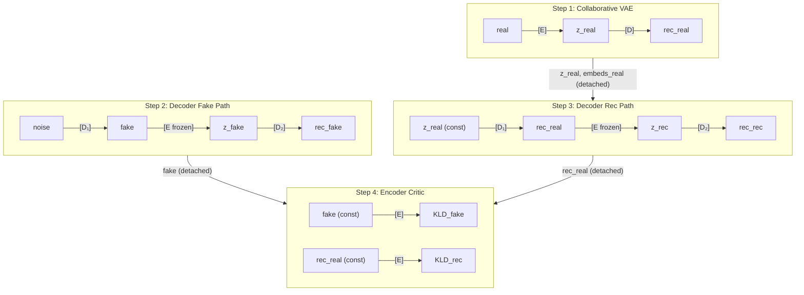

# Training Orchestration

## Overview: 4-Step Collaborative + Adversarial Training

The training step is decomposed into four sequential sub-steps, each building a small independent computation graph. Gradients are applied per-step (not accumulated), and tensors produced by earlier steps are detached before reuse in later steps.



### Why 4 Separate Graphs (Not 1 or 2)

| Property | Old design (2 monolithic graphs) | New design (4 small graphs) |
|---|---|---|
| Forward passes | 14 | 10 |
| Peak GPU memory | ~2.1GB activations | ~1.3GB activations |
| Encoder gets adversarial signal to D | ❌ (severed by no_grad) | ✅ (flows through frozen E) |
| E+D cooperate on manifold | ❌ Never | ✅ Step 1 |
| Graph complexity | 7 passes in one backward | 2–3 passes per backward |

### Per-Step Gradient Application (Not Accumulation)

Gradients are applied immediately after each step's backward pass rather than accumulated across all steps:

```python
# Step 1: collaborative
loss.backward()
apply_encoder_gradients()
apply_decoder_gradients()

# Steps 2+3: decoder adversarial (gradients accumulate across 2 & 3)
loss_fake.backward()
loss_rec.backward()
apply_decoder_gradients()

# Step 4: encoder critic
loss.backward()
apply_encoder_gradients()
```

**Rationale for per-step application:**

1. **Different gradient characters.** Collaborative (step 1) and adversarial (steps 2–4) gradients have fundamentally different directions. Adam's momentum should track them separately rather than averaging opposing signals into a confused direction.

2. **Sequential parameter updates create correct ordering.** Step 1 updates D, then steps 2/3 use the _updated_ D. This means the adversarial steps always operate on the most recent reconstructor — the decoder is a better generator before being asked to fool the encoder.

3. **Clean callback integration.** The equilibrium callback can disable steps 2/3/4 independently. With per-step apply, disabling a step means "skip backward + apply" — no partial gradient surgery needed.

4. **Steps 2 and 3 accumulate deliberately.** Both are decoder adversarial objectives operating on the same parameters. Accumulating their gradients before a single `apply_decoder_gradients()` gives the optimizer a combined view of "fool the encoder on both paths simultaneously."

---

## Step 1: Collaborative VAE

**Purpose:** Jointly train E + D to maximize ELBO on real data. Establishes the normal manifold.

```
real → [E] → (μ, σ, embeds) → reparam → z → [D] → rec_real
```

**Both E and D trained.** This is the only step where E and D cooperate.

**Loss:**

$$\mathcal{L}_{\text{collab}} = -\text{ELBO}_{\text{real}} = \text{MSE}(\text{real}, \text{rec}) + \beta \cdot \text{KLD}(\mu, \sigma)$$

**Gradient flow:**
- **Encoder** receives: "map reals to low-KLD latent codes that preserve reconstructable information"
- **Decoder** receives: "reconstruct faithfully from the codes the encoder produces"

**Outputs retained as constants (stop-gradiented) for later steps:**
- `z_real` — reused in step 3
- `embeds_real` — reused in step 3 (embedding loss target)

**Why this step is essential:** Without cooperative training, the encoder and decoder never jointly optimize the normal manifold. The encoder could learn latent codes that are "correct" (low KLD) but useless for reconstruction, while the decoder learns to reconstruct from a different latent distribution. Step 1 forces agreement.

---

## Step 2: Decoder Fools Encoder (Fake Path)

**Purpose:** Train D to generate images from noise that the encoder considers normal AND that survive round-tripping.

```
noise → [D₁] → fake → [E_frozen_differentiable] → (μ, σ) → reparam → z_fake → [D₂] → rec_fake
```

**Only D trained.** E is frozen (`trainable=False`) but the computation graph is stored through it — gradients flow back through E's forward pass into D₁.

**Loss:**

$$\mathcal{L}_{\text{fake}} = \exp(-\tau_d \cdot \text{ELBO}_{\text{fake}})$$

where $\text{ELBO}_{\text{fake}} = -\text{MSE}(\text{sg}(\text{fake}), \text{rec\_fake}) - \beta \cdot \text{KLD}(\mu_{\text{fake}}, \sigma_{\text{fake}})$

**Critical design choices:**

1. **`fake` is stop-gradiented as MSE target** — prevents the degenerate solution where D₁ minimizes MSE by changing the target (which it controls) rather than improving the prediction.

2. **`z_fake` is NOT stop-gradiented** — D₂'s MSE gradient flows back through `z → reparam → (μ,σ) → E → fake → D₁`. This gives D₁ the cycle consistency signal: "produce images that survive round-tripping through encode→decode."

3. **E is frozen but differentiable** — KLD gradient flows through E back to D₁: "produce images that encode close to the prior." This is the proper adversarial generation signal that was entirely missing in the old design.

**Gradient signals to D₁ (first decoder call):**
- Via KLD path through E: "generate images the encoder considers normal (low KLD)"
- Via MSE→D₂→z→E path: "generate images that survive encode→decode round-trip (cycle consistency)"

**Gradient signals to D₂ (second decoder call):**
- Direct MSE: "reconstruct `fake` faithfully from `z_fake`"

**Output retained as constant:** `fake` (detached) — reused in step 4.

---

## Step 3: Decoder Fools Encoder (Reconstruction Path)

**Purpose:** Train D to produce reconstructions that fool the encoder AND match the original perceptually.

```
z_real(const) → [D₁] → rec_real → [E_frozen_differentiable] → (μ, σ, embeds_rec) → reparam → z_rec → [D₂] → rec_rec
```

**Only D trained.** E is frozen but differentiable (same as step 2).

**Loss:**

$$\mathcal{L}_{\text{rec}} = \exp(-\tau_d \cdot \text{ELBO}_{\text{rec}}) + \lambda_{\text{embed}} \cdot \mathcal{L}_{\text{embed}}(\text{sg}(\text{embeds\_real}),\ \text{embeds\_rec})$$

where $\text{ELBO}_{\text{rec}} = -\text{MSE}(\text{sg}(\text{rec\_real}), \text{rec\_rec}) - \beta \cdot \text{KLD}(\mu_{\text{rec}}, \sigma_{\text{rec}})$

**Critical design choices:**

1. **`rec_real` is stop-gradiented as MSE target** — same rationale as step 2.

2. **`z_rec` is NOT stop-gradiented** — D₁ gets cycle consistency signal through D₂→z_rec→E→rec_real→D₁.

3. **Embedding loss uses `embeds_real` from step 1 as frozen target** — the decoder receives gradient saying "change your output so that when the encoder re-encodes it, the resulting features match the frozen target."

**Gradient signals to D₁:**
- Via embed_loss through E: "produce reconstructions perceptually matching the original"
- Via KLD path through E: "produce reconstructions that encode normally"
- Via MSE→D₂→z_rec→E path: "produce reconstructions that survive re-encoding"

**Gradient signals to D₂:**
- Direct MSE: "reconstruct `rec_real` faithfully from `z_rec`"

**Output retained as constant:** `rec_real` (detached) — reused in step 4.

---

## Step 4: Encoder Discriminates (Critic)

**Purpose:** Train E to discriminate decoder outputs from real samples via KLD.

```
fake(const) → [E] → (μ_fake, σ_fake) → KLD_fake
rec_real(const) → [E] → (μ_rec, σ_rec) → KLD_rec
```

**Only E trained.** D is not involved. Inputs are constants from steps 2 and 3.

**Loss:**

$$\mathcal{L}_{\text{critic}} = \exp(-\tau_e \cdot \text{KLD}_{\text{fake}}) + \exp(-\tau_e \cdot \text{KLD}_{\text{rec}})$$

**Why pure KLD (no ELBO):** The encoder's discrimination mechanism is "real images encode with low KLD; decoder outputs encode with high KLD." There is no reconstruction term because the encoder doesn't decode anything — it purely classifies via latent statistics.

**Curriculum weighting:**
- KLD ≈ 0 (hard to discriminate): $\exp(0) = 1$ → full gradient
- KLD ≫ 0 (easy to discriminate): $\exp(-\tau_e \cdot \text{large}) \approx 0$ → ignore

This focuses the encoder on hard cases — decoder outputs that already look normal — rather than wasting capacity on obvious fakes.

**Why both `fake` and `rec_real`:** Averaging both paths prevents the encoder from learning an asymmetric shortcut (e.g., strong on fakes but weak on reconstructions). The equilibrium callback monitors `diff_kld = 0.5*(KLD_fake + KLD_rec) - KLD_real` to detect dominance on _either_ path.

---

## Memory Analysis

Each step builds a small graph, backpropagates, then frees activations before the next step.

| Step | Graph composition | Peak activations |
|---|---|---|
| 1 | 1× E + 1× D | E_act + D_act |
| 2 | 2× D + 1× E (frozen, graph stored) | 2×D_act + E_act |
| 3 | 2× D + 1× E (frozen, graph stored) | 2×D_act + E_act |
| 4 | 2× E | 2×E_act |

**Peak memory = max(any single step) = steps 2 or 3 ≈ 2×D_act + E_act**

For a MobileNetV3 encoder + MobileNetV3-style decoder at 224×224, batch=16:
- Old design peak: ~2.1GB (4 decoder activations in one graph)
- New design peak: ~1.3GB (2 decoder + 1 encoder activations)

**38% reduction** while gaining proper gradient flow.

---

## Interaction with Equilibrium Callback

The callback monitors `diff_kld` and can independently disable steps:

| Callback state | Step 1 | Steps 2/3 | Step 4 |
|---|---|---|---|
| **Train both** | ✅ E+D | ✅ D | ✅ E |
| **Encoder paused** (diff_kld > upper) | ✅ E+D | ✅ D | ❌ Skip |
| **Decoder paused** (diff_kld < lower) | ✅ E+D | ❌ Skip | ✅ E |

**Step 1 always runs** — the cooperative VAE objective is never adversarial and should never be paused. It maintains reconstruction quality regardless of adversarial balance.

When a step is skipped, a no-grad forward pass still executes to produce the detached tensors needed by downstream steps (fake, rec_real for step 4).
