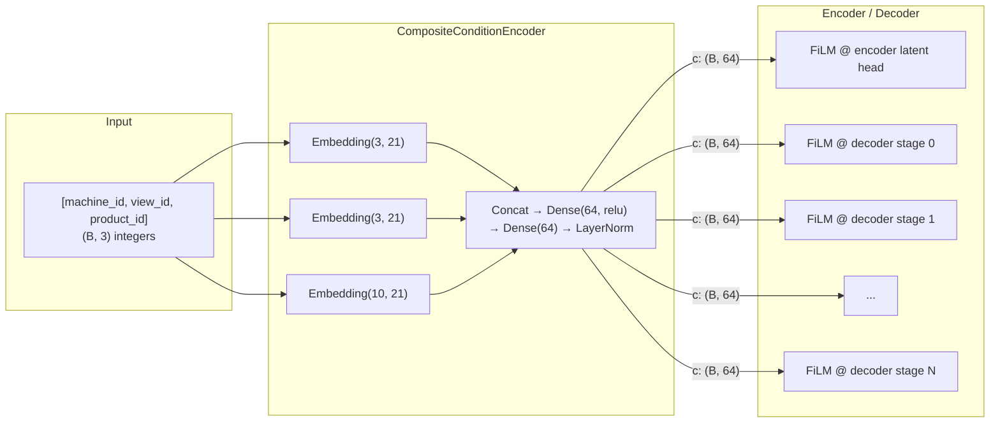

# Conditioning Architecture: FiLM & CompositeConditionEncoder

## Overview

The conditioning system enables multi-product, multi-view training from a single model. Instead of training one model per product/machine configuration, a **condition vector** tells the model which product it's processing, allowing it to modulate its behavior accordingly.

The architecture has two components:

1. **CompositeConditionEncoder** — maps raw categorical IDs `(machine_id, view_id, product_id)` to a dense embedding vector `c ∈ ℝ^embed_dim`
2. **FiLM layers** — modulate encoder/decoder feature maps using the embedding vector



---

## CompositeConditionEncoder

### Purpose

Maps a heterogeneous condition vector (mix of categorical IDs and optional continuous values) to a fixed-size dense embedding that FiLM layers consume.

### Architecture

```
Input: (B, num_fields) — e.g., (B, 3) for [machine_id, view_id, product_id]
  → Split into individual fields
  → Per-field:
      Categorical: Embedding(vocab_size, per_field_dim)
      Continuous:  Dense(per_field_dim, relu) → Dense(per_field_dim)
  → Concatenate all field embeddings
  → Dense(embed_dim, relu) → Dense(embed_dim) → LayerNormalization
Output: (B, embed_dim) — e.g., (B, 64)
```

### Key Design Choices

| Choice                                                      | Rationale                                                                                                                                                                                               |
| ----------------------------------------------------------- | ------------------------------------------------------------------------------------------------------------------------------------------------------------------------------------------------------- |
| `embed_dim = 64`                                            | Fixed API contract. Never changes regardless of num_products/views. Allows FiLM projection weights to be reused across different condition encoders.                                                    |
| LayerNormalization at output                                | Ensures consistent scale for frozen FiLM projections during transfer learning. Without it, a new condition encoder could produce embeddings at arbitrary scale, destabilizing frozen downstream layers. |
| Per-field embedding dim = `max(8, embed_dim // num_fields)` | Balanced capacity per field. Auto-scales with number of fields.                                                                                                                                         |
| Separate embedding tables per field                         | Machine ID 2 ≠ View ID 2 ≠ Product ID 2. Shared embedding would conflate semantically different categories.                                                                                             |

### Configuration

```python
CompositeConditionEncoder(
    vocab_sizes=[3, 3, 10],  # [num_machines, num_views, num_products]
    embed_dim=64,            # FIXED — the API contract
    field_embed_dim=None,    # Auto: max(8, 64 // 3) = 21
)
```

The `vocab_sizes` list defines the first N fields as categorical (looked up in embedding tables). Any remaining dimensions in the input are treated as continuous and projected through an MLP.

---

## FiLM: Feature-wise Linear Modulation

### Mechanism

FiLM applies a per-channel affine transformation to feature maps, conditioned on the embedding vector:

$$\text{output} = \text{features} \cdot (1 + \gamma) + \beta$$

where $\gamma, \beta \in \mathbb{R}^C$ are predicted from the conditioning vector $c \in \mathbb{R}^{d}$ via:

```
c: (B, embed_dim)
  → Dense(embed_dim, relu)
  → Dense(2 * feature_channels)
  → Reshape to (B, 1, 1, 2C) or (B, 2C, 1, 1)
  → Split → γ: (B, 1, 1, C), β: (B, 1, 1, C)
```

### Initialization: Identity Transform

At initialization, projection weights are small/zero, so:

- $\gamma \approx 0 \Rightarrow 1 + \gamma \approx 1$ (multiplicative identity)
- $\beta \approx 0$ (additive identity)

This means a freshly initialized FiLM layer is a **no-op** — the model starts as if unconditional and gradually learns to modulate based on condition.

### Placement

| Location | Layer                            | Purpose                                                                                |
| -------- | -------------------------------- | -------------------------------------------------------------------------------------- |
| Encoder  | 1× at latent projection head     | Condition-aware µ/logvar without modifying pretrained backbone features                |
| Decoder  | 1× before each stage (5–6 total) | Per-resolution conditioning; different products may need different upsampling behavior |

```
Encoder:
  Backbone(frozen) → features → FiLM(c) → to_mean/to_logvar

Decoder:
  z → stem → [FiLM(c) → Stage_0] → [FiLM(c) → Stage_1] → ... → to_rgb
```

### Why FiLM Only at the Encoder Head (Not Throughout Backbone)

The encoder backbone (MobileNetV3) is pretrained on ImageNet and initially frozen. Its feature extraction should be **product-agnostic** — it detects edges, textures, and structures regardless of what product is being scanned.

Conditioning only needs to influence the **interpretation** of those features (the projection to latent space), not the features themselves. Placing FiLM inside the backbone would:

1. Modify frozen weights' effective behavior (fighting the pretrain)
2. Require unfreezing to learn meaningful modulation (losing pretrain benefits)
3. Increase parameter count without benefit (backbone already extracts generic features)

The latent head is the minimal, correct location: "given these generic features, produce condition-specific latent statistics."

### Why FiLM at Every Decoder Stage

Unlike the encoder backbone, the decoder has no pretrained weights. It must learn product-specific generation behavior from scratch. Different products have different:

- Spatial structure (cans vs. jars vs. bread)
- Intensity profiles (glass vs. aluminum vs. organic)
- Edge characteristics (smooth vs. textured)

FiLM at every stage allows the decoder to modulate generation behavior at every resolution level — coarse structure at early stages, fine texture at later stages.

---

## Why FiLM Over Concatenation

The previous architecture concatenated a spatial conditioning tensor with features at the bottleneck:

```python
# Old: concat-based conditioning
x = Concatenate()([z, c])  # c was (B, H, W, C_cond) spatial
x = stem(x)
```

Problems with concatenation for multi-product training:

| Problem                                                                                                                     | FiLM Solution                                                                                        |
| --------------------------------------------------------------------------------------------------------------------------- | ---------------------------------------------------------------------------------------------------- |
| **Changing channel count**: Adding products/views changes `C_cond`, requiring new conv weights throughout the decoder       | FiLM's `embed_dim` is fixed. Only the condition encoder's embedding tables grow.                     |
| **Transfer learning impossible**: New customer = new cond channels = new decoder weights = retrain everything               | Freeze FiLM projections + backbone. Swap only the condition encoder. Decoder conv weights unchanged. |
| **Wasted capacity**: First conv after concat must learn to "ignore" extra channels; spatial conditioning occupies bandwidth | FiLM modulates multiplicatively — no extra channel bandwidth consumed.                               |
| **No multi-resolution conditioning**: Concat only at bottleneck; downstream stages get no direct condition signal           | FiLM at every stage — condition influences all resolutions.                                          |

---

## Gradient Flow with Conditioning

The condition encoder participates in training with strict gradient isolation:

```
Step 1 (Collaborative):
    condition.trainable = True
    c = condition(raw_cond)           ← GRADIENT FLOWS to condition encoder
    encoder([x, c])                   ← GRADIENT FLOWS to encoder
    decoder([z, stop_gradient(c)])    ← NO gradient to condition from decoder

Step 2 (Decoder fake):
    condition.trainable = False
    c = stop_gradient(condition(raw_cond, training=False))
    decoder, encoder frozen-differentiable

Step 3 (Decoder rec):
    condition.trainable = False
    c = stop_gradient(condition(raw_cond, training=False))
    decoder, encoder frozen-differentiable

Step 4 (Encoder critic):
    condition.trainable = False
    c = stop_gradient(condition(raw_cond, training=False))
    encoder trains, decoder frozen
```

### Why `stop_gradient(c)` Before Decoder in ALL Steps

Even in step 1 where the condition encoder trains, `c` is detached before entering the decoder. Rationale:

1. **Single coherent training signal**: The condition encoder should learn from ONE objective — the KLD signal via the encoder path. This tells it: "produce embeddings that help the encoder structure latent space correctly for this product."

2. **No reconstruction shortcut**: If the decoder could backprop into the condition encoder, it would learn to encode reconstruction shortcuts into `c` (e.g., product-specific bias terms that reduce MSE without the encoder learning anything). The condition encoder would become a "cheat sheet" for the decoder rather than a true conditioning signal.

3. **Indirect reconstruction pressure already exists**: Better condition encoder → encoder produces tighter latent distributions → KLD increases for decoder fakes → decoder must improve → better reconstruction. The information flows through the correct channel.

### Optimizer Assignment

Three optimizer configurations are supported:

| Config                                      | Condition trains with      | Use case                                                                            |
| ------------------------------------------- | -------------------------- | ----------------------------------------------------------------------------------- |
| `cond_optimizer=None`                       | Encoder optimizer (shared) | Default: condition encoder is small, LR matches encoder head                        |
| `cond_optimizer=Adam(lr=1e-4)`              | Dedicated optimizer        | When condition encoder needs different LR (e.g., warm-start from larger embeddings) |
| Condition frozen (`trainable=False` always) | N/A                        | Inference-only or transfer after condition is pretrained                            |

---

## Transfer Learning Strategy

The `embed_dim = 64` contract enables a clean transfer protocol:

```
┌──────────────────────────────────────────────────────────────────┐
│  Customer A (trained)                                            │
│                                                                  │
│  CondEncoder_A(vocab=[3,3,10]) ───┐                              │
│                                   ├── embed_dim=64 ── FiLM ──┐   │
│  Encoder(frozen backbone + head) ─┘                          │   │
│  Decoder(all stages)            ←────────────────────────────┘   │
└──────────────────────────────────────────────────────────────────┘

                    ↓ Transfer to Customer B ↓

┌──────────────────────────────────────────────────────────────────┐
│  Customer B (fine-tune)                                          │
│                                                                  │
│  CondEncoder_B(vocab=[2,2,5]) ──── NEW, random init              │
│                                   ├── embed_dim=64 ── FiLM ──┐   │
│  Encoder(frozen)                 ─┘         FROZEN           │   │
│  Decoder(all stages)            ←──────── FROZEN ────────────┘   │
└──────────────────────────────────────────────────────────────────┘
```

**What transfers:**

- Encoder backbone + head weights (generic X-ray feature extraction)
- FiLM projection weights (learned modulation patterns)
- Decoder stage weights (learned generation patterns)

**What's replaced:**

- CompositeConditionEncoder (new vocabulary sizes for new products)

**Why this works:**

- LayerNorm on condition encoder output ensures new embeddings are at the same scale the frozen FiLM projections expect
- FiLM initialized as identity means even random `c` vectors produce reasonable (unconditioned) behavior initially
- Fine-tuning only the condition encoder is cheap (few parameters) and fast (clear gradient signal from KLD)

---

## Edge Deployment: FiLM Collapse

For single-product deployment (one product, one machine, one view), the condition is a constant:

```python
c_fixed = condition_encoder([machine_id, view_id, product_id])  # (1, 64) — precomputed

# FiLM becomes constant affine:
gamma_fixed, beta_fixed = film.projection(c_fixed)  # Precomputed

# At inference, FiLM collapses to:
output = features * (1 + gamma_fixed) + beta_fixed  # Zero runtime overhead vs unconditional
```

This can be fused into adjacent BatchNorm/Conv layers during ONNX export, resulting in **zero additional runtime cost** compared to an unconditional model.

---

## Hyperparameters

| Parameter               | Default       | Constraint          | Notes                                                      |
| ----------------------- | ------------- | ------------------- | ---------------------------------------------------------- |
| `embed_dim`             | 64            | **Never change**    | API contract between condition encoder and all FiLM layers |
| `vocab_sizes`           | `[3, 3, 10]`  | Must match data     | `[num_machines, num_views, num_products]`                  |
| `field_embed_dim`       | `None` (auto) | Optional            | Override per-field embedding size                          |
| FiLM layers per decoder | 5–6           | Matches stage count | One per decoder stage                                      |
| FiLM layers per encoder | 1             | Fixed               | Only at latent projection head                             |
